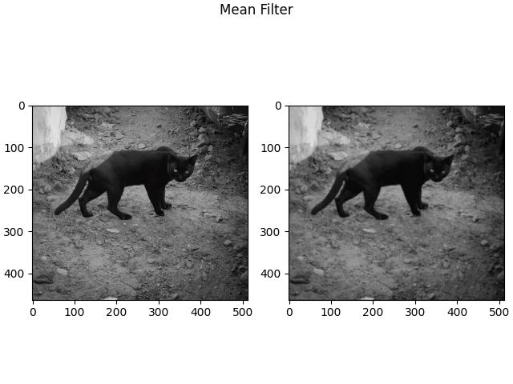

# CompVis
Implementation of most common computer vision algorithms.

## Requirements
* Tkinter: ``sudo apt install python3-tk``
* matplotlib
* numpy
* pillow

run ``pip install -r requirements.txt``

## How to run

### mean filter
Example
``python3 -m spatial_filters.mean --input ./images/cat_512.jpg --kernel_size 5``

Results

### Median Filter
Example 

``python3 -m spatial_filters.median --input ./images/cat_saltpepper.jpg --kernel_size 3 --save --compare``

Result

## TODO
* Spetial filters (~~mean~~, ~~median~~, ~~gaussian~~)
* Frequency domain filter (High pass, low pass, ideal, gaussian, butterworth)
* Pixel wise operations (contrast, brightness, grayscale)
* White Balancing, Retinex
* Edge Detection: (LoG, Canny)
* Local Descriptors: (corner, SIFT, Gabor Filter, LBP)
* Add more

## Image source
Taken by me at IIT Kharagpur
